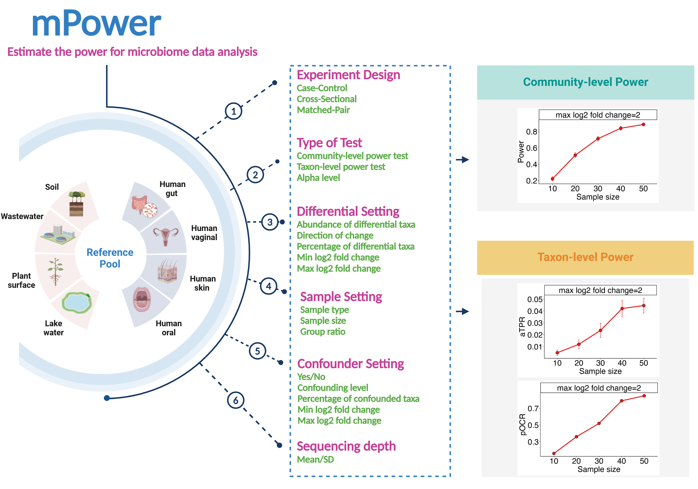

This package estimates the power for microbiome study design based on various experimental designs and parameters. 




# 1. Usage
## 1.1 Package installation

You can install mPower as follows:

``` r
# install.packages("devtools")
devtools::install_github("chloelulu/mPower")
```

## 1.2 Shiny R App

You can also use our Shiny App without coding skills, please access the Shiny App at: https://microbiomestat.shinyapps.io/mPower/

# 2. Examples

You need to have a reference feature table, it should be a collection of microbiome sequencing samples from a study population at a specific sampling site. It should be large enough to capture the main compositional variation in the population of interest. 


```{r error=TRUE, message=FALSE, warning=FALSE, include=T, results="hide"}
library(mPower)
data(feature.dat)
```

Preprocessing: exclude features present in fewer than 2 samples.
```{r}
feature.dat <- feature.dat[rowSums(feature.dat != 0) > 2, ]
```

Estimate the parameters: We will obtain posterior samples of the underlying composition based on an empirical Bayes model, and generate the absolute abundance of the reference feature table. 

```{r, message=FALSE, warning=FALSE}
model.paras <- EstPara(ref.otu.tab = feature.dat)
```

### 2.1 Estimate Community-Level Power for Case-Control Study

Assume you are designing a case-control gut microbiome study (e.g., cancer vs healthy individuals) and want to determine the sample size needed to achieve 80% community-level and taxa-level power.

* Set the sample size: if you are not sure how many sample size could be enough to achieve desirable power, i.e., 90% power, you can set a range of sample sizes, such as (20, 60, 100).  

* Set the iterations: 500 at least for community-level power estimate. 

* Set alpha: alpha for community-level means the probability of rejecting the null hypothesis when it is true. Default 0.05 is chosen. 

* Set distance: Bray-Curtis or Jaccard distance can be chosen. Here we choose "BC" considers both presence and species abundance.

* Set the effect sizes: 
  - (1) the percentage of differential taxa: can be estimated based on the association p-value distribution. 
  - (2) "mPower" allows the effect size (log2 fold change, LFC, between two groups, or in response to 1 S.D. change of a continuous variable) to come from a probabilistic distribution. In current implementation, it assumes a uniform distribution on the interval [min LFC , max LFC]. The max LFC can be easily estimated from real data while min LFC is set to 0 by default. When min LFC = max LFC, a fixed LFC is set for all differential taxa. 

* Set the differential setting to set the direction of differential taxa, either "unbalanced" for creating strong compositional effect or "balanced" for moderate compositional effect. Here we choose "balanced". 

* Set the differential taxa from "rare" or "abundant" or "random", indicating the direction of change for these differential taxa.


```{r, message=FALSE, warning=FALSE}
res1 <- mPower(feature.dat = feature.dat, model.paras = model.paras,
               test = 'Community', design = 'CaseControl',
               nSams = c(20, 60, 100), grp.ratio = 0.5,
               iters = 500, alpha = 0.05, distance = 'BC',
               diff.otu.pct = 0.1, 
               covariate.eff.min = 0, covariate.eff.maxs = 2,
               diff.otu.direct = 'balanced',diff.otu.mode = 1,
               confounder = 'no', depth.mu = 10000, depth.sd = 4000, verbose = F)
```

#### 2.1.1 Output1: Community-level power table 

"power"(community-level power): the probability of rejecting the null hypothesis when the null hypothesis is false. An pOCR at least 90% will ensure a high likelihood of making some discoveries. Thus in this example, around 100 samples should be well-powered. 
```{r error=TRUE, message=FALSE, warning=FALSE, include=T, results="asis"}
knitr::kable(res1$power, format = "markdown")
```

#### 2.1.2 Output2: \( R^2 \) (variance explained) and community-level power curve

\( R^2 \): the proportion of the total variation in the response data that is explained by the explanatory variables.
```{r fig.height=6, fig.width=16}
res1$plot
```


### 2.2 Estimate Taxa-Level Power for Case-Control Study
```{r, message=FALSE, warning=FALSE, results='hide'}
res2 <- mPower(feature.dat = feature.dat, model.paras = model.paras,
               test = 'Taxa', design = 'CaseControl',
               nSams = c(20, 60, 100), grp.ratio = 0.5,
               iters = 50, alpha = 0.05, distance = 'BC',
               diff.otu.pct = 0.1, diff.otu.direct = 'balanced',diff.otu.mode = 1,
               covariate.eff.min = 0, covariate.eff.maxs = 2,
               prev.filter = 0.1, max.abund.filter = 0.002,
               confounder = 'yes', depth.mu = 100000, depth.sd = 4000, verbose = F)
```

#### 2.2.1 Output1: Taxa-level power table - aTPR

"aTPR"(average true positive rate): represents the average proportion of truly differential taxa that are correctly identified as such. SD, ymax and ymin represents standard deviation, the upper and lower bound of the 95% confidence interval for the aTPR, respectively.
```{r error=TRUE, message=FALSE, warning=FALSE, include=T, results="asis"}
knitr::kable(res2$aTPR, format = "markdown")

```

#### 2.2.2 Output1: Taxa-level power table - pOCR 

"pOCR"(probability of making at least one correct rejection): akin to the conventional understanding of power, differs in that the specific taxa rejected need not be consistent.
```{r error=TRUE, message=FALSE, warning=FALSE, include=T, results="asis"}
knitr::kable(res2$pOCR, format = "markdown")
```

#### 2.2.3 Output3: aTPR power curve(left) and pOCR power curve(right)

```{r fig.height=6, fig.width=16}
res2$plot
```

## References

[@yang2022comprehensive; @yang2023benchmarking; @yang2024mpower]


