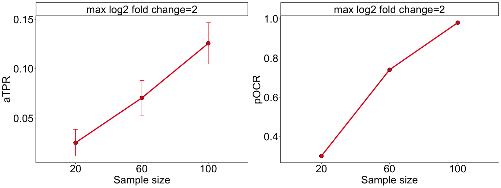

mPower: A Real Data-based Power Analysis Tool for Microbiome Study
Design
================
2024-07-17

This package estimates the power for microbiome study design based on
various experimental designs and parameters. For details of the proposed
method, please refer to the following paper: Lu Yang, Jun Chen. mPower:
A Real Data-based Power Analysis Tool for Microbiome Study Design


## 1. Usage

### 1.1 Package installation

You can install mPower as follows:

``` r
# install.packages("devtools")
devtools::install_github("chloelulu/mPower")
```

### 1.2 Shiny R App

You can also use our Shiny App without coding skills, please access the
Shiny App at: <https://microbiomestat.shinyapps.io/mPower/>

## 2. Examples

Assume you are designing a case-control gut microbiome study (e.g.,
cancer vs healthy individuals) and want to determine the sample size
needed to achieve 80% community-level and taxa-level power. Assume a log
2 fold change of 2 based on the literature.

``` r
library(reactable) # show table in Markdown
library(mPower)
data(feature.dat)
```

Exclude features present in fewer than 2 samples

``` r
feature.dat <- feature.dat[rowSums(feature.dat != 0) > 2, ]
```

Estimate the parameters

``` r
model.paras <- EstPara(ref.otu.tab = feature.dat)
```

#### 2.1 Estimate Community-Level Power for Case-Control Study

``` r
res1 <- mPower(feature.dat = feature.dat, model.paras = model.paras,
               test = 'Community', design = 'CaseControl',
               nSams = 50, grp.ratio = 0.5,
               iters = 500, alpha = 0.05, distance = 'BC',
               diff.otu.pct = 0.1, diff.otu.direct = 'balanced',diff.otu.mode = 'random',
               covariate.eff.min = 0, covariate.eff.maxs = c(1, 2),
               confounder = 'no', depth.mu = 10000, depth.theta = 5, verbose = F)
```

##### 2.1.1 Output1: Community-level power table (“power” column indicates community-level power)

| Sample size | max log2 fold change | power |        SD |      ymax |      ymin |
|:------------|:---------------------|------:|----------:|----------:|----------:|
| 50          | 1                    | 0.370 | 0.4832878 | 0.4123620 | 0.3276380 |
| 50          | 2                    | 0.754 | 0.4311099 | 0.7917884 | 0.7162116 |

Community-Level Power Table

##### 2.1.2 Output2: R2 (variance explained) and community-level power curve

<!-- -->

#### 2.2 Estimate Taxa-Level Power for Case-Control Study

``` r
res2 <- mPower(feature.dat = feature.dat, model.paras = model.paras,
               test = 'Taxa', design = 'CaseControl',
               nSams = c(20, 80), grp.ratio = 0.5,
               iters = 50, alpha = 0.05, distance = 'BC',
               diff.otu.pct = 0.1, diff.otu.direct = 'balanced',diff.otu.mode = 'random',
               covariate.eff.min = 0, covariate.eff.maxs = 2,
               prev.filter = 0.1, max.abund.filter = 0.002,
               confounder = 'yes', depth.mu = 100000, depth.theta = 5, verbose = F)
```

##### 2.2.1 Output1: Taxa-level power table (“pOCR” column indicates the probability of making at least one correct rejection)

| Sample size | max log2 fold change | pOCR |
|:------------|:---------------------|-----:|
| 20          | 2                    | 0.34 |
| 80          | 2                    | 0.92 |

Taxa-Level Power Table

##### 2.2.2 Output2: Taxa-level power table (“aTPR” column indicates the average true positive rate)

| Sample size | max log2 fold change |      aTPR |        SD |      ymax |      ymin |
|:------------|:---------------------|----------:|----------:|----------:|----------:|
| 20          | 2                    | 0.0186403 | 0.0288390 | 0.0266341 | 0.0106466 |
| 80          | 2                    | 0.1068024 | 0.0681121 | 0.1256821 | 0.0879227 |

Taxa-Level Power Table

##### 2.2.3 Output3: aTPR power curve(left) and pOCR power curve(right)

<!-- -->
